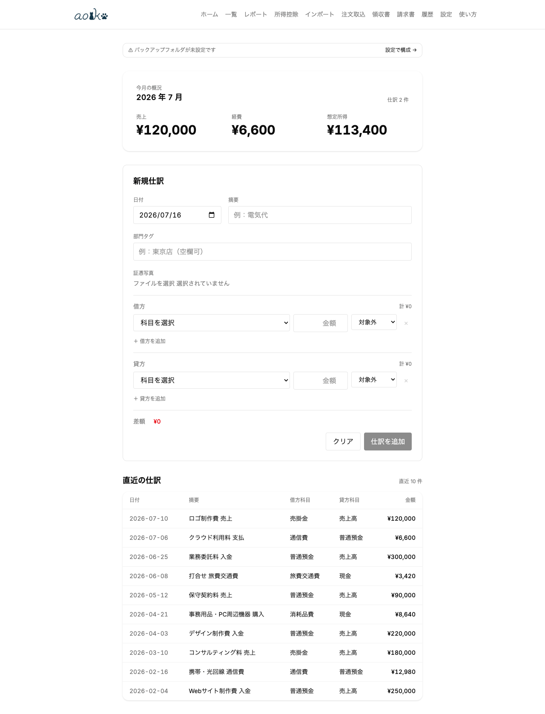
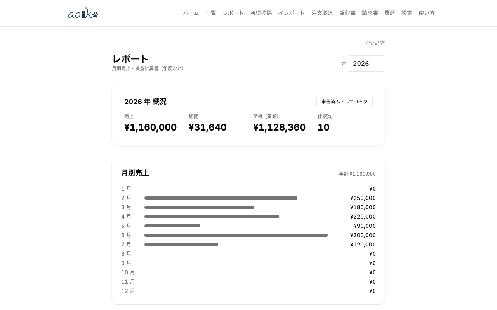

# aoiko（あおいこ）

<p align="center">
  
</p>

**Language**: **日本語** | [English](README_en.md) | [繁體中文](README_zh-TW.md)

[](https://github.com/Lonshaus/aoiko/actions/workflows/ci.yml) [](LICENSE)

🌐 **オンラインでお試し**: <https://aoiko.pages.dev>（お試し版・注意点は「[利用者向け：ローカル起動](#利用者向けローカル起動)」を参照）

日本の個人事業主向け、純フロントエンド帳簿ツール。青色申告 **75 万円**控除（令和 9 年分以降、要 e-Tax 期限内提出 + 優良な電子帳簿保存 / 改正前の 65 万円控除にも引き続き対応）を目標に、CSV/OCR/EC 注文ページからの取り込み、複式簿記、減価償却、貸借対照表、`.xtx` 出力までを Web App 単体で完結させる。白色申告（収支内訳書）にも対応。バックエンド無し、BYOK（API キーは利用者が持参）。

<p align="center">
  
  
</p>


## 主な機能

- **複式簿記**：仕訳・訂正仕訳（修正仕訳）・電子帳簿保存法準拠の監査履歴
- **CSV 取り込み**：銀行＝三菱UFJ／三井住友／SBI新生／PayPay（クレジット決済運用、残高は未対応）、カード＝楽天／JCB（リクルートカード等含む）／セゾン／三井住友／三菱UFJ／au PAY／PayPay／ビュー（JRE CARD）／ライフ。すべて実 CSV で検証済
- **取込履歴**：CSV インポートのバッチ単位履歴、ファイルハッシュによる重複検知、バッチごとの一括 reverse 対応
- **OCR**：領収書 → 仕訳候補。エンジンは Gemini Vision（既定）／OpenAI 互換 / Ollama 等のローカル vision LLM／**Tesseract（純ローカル WASM OCR・精度限定・人手確認前提）** から選択
- **注文取込（貼り付け → LLM 抽出）**：Amazon・楽天 等の注文ページ全文を貼り付け、LLM で品目内訳を抽出 → 確認 → 仕訳化。DOM 爬取に依存せずサイト改修に強い
- **LLM 分類**：CSV 行 → 勘定科目（ルール優先・LLM フォールバック）。エンジンは Gemini またはローカル AI を選択可
- **OCR/LLM のプライバシー**：外部送信前に確認ダイアログ。Ollama 等を localhost 指定または Tesseract 選択時は画像が端末外に出ない（Ollama はローカル実行版限定・`OLLAMA_ORIGINS` 設定要、Tesseract は traineddata 初回 DL のみ・自己ホスト可で完全オフライン）
- **家事按分**：自宅兼事務所の経費を事業使用分・事業主貸へ自動分割
- **減価償却**：定額法・200% 定率法（耐用年数 2〜20 年）、月按分・1 円残し
- **少額減価償却資産特例**：措法 28 の 2（30→40 万、2026-04-01〜）、年合計 300 万円上限管理
- **前期繰越**：前年末残高 → 期首振替仕訳の自動生成（純利益・事業主貸借を元入金へ吸収）
- **開業時の設定（開業精霊）**：開業費・転用資産（非業務用→業務用転用の未償却残高を国税庁方式で自動計算）・自由項目をまとめて仕訳・固定資産登録
- **消費税概算**：本則・簡易（第 1〜6 種）・2 割特例・3 割特例の 4 方式比較、経過措置 80/70/50/30% 自動適用
- **e-Tax `.xtx` 出力**：確定申告書（KOA020）+ 決算書（青色申告決算書 KOA210 または収支内訳書 KOA110、確定申告方式で切替）を国税庁公式 XSD 準拠で 1 ファイルに併載、実機組み込み検証済み
- **報表**：月別売上・損益計算書・貸借対照表・月別 PL（科目 × 月）・取引先別 / 補助科目別集計・消費税 4 方式比較
- **複合検索（優良な電子帳簿要件）**：仕訳一覧で 年/月/摘要/金額範囲/取引先 の組み合わせ検索（電子帳簿保存法の「2 以上の任意の組み合わせ」要件対応）
- **請求書・見積書**：明細行・税率別内訳（インボイス制度の登録番号・税率別消費税額を記載）付きの作成・印刷、発行時の売掛金仕訳自動生成、打消し仕訳による訂正、見積書 → 請求書変換
- **修正申告ガイド**：申告済スナップショットと現在値の差分表示 + 提出手順
- **バックアップ**：File System Access API（Chromium）→ OPFS（Safari/Firefox）の自動フォールバック
- **PWA**：オフライン動作

## 技術構成

| Layer | Tech |
|-------|------|
| UI | Svelte 5（runes） + Tailwind + bits-ui + shadcn-svelte |
| Build | Vite + vite-plugin-pwa |
| Storage | IndexedDB（Dexie）+ File System Access API / OPFS |
| Money | Decimal.js（14+2 ゼロパディング辞書順インデックス） |
| OCR / LLM | 設定で選択：Google Gemini API（BYOK）／OpenAI 互換・Ollama 等のローカル vision LLM／Tesseract（純ローカル WASM OCR） |
| Test | Vitest + fake-indexeddb |
| Lang | TypeScript strict + `noUncheckedIndexedAccess` + `exactOptionalPropertyTypes` |

> SvelteKit 不使用（純 SPA、自前 history router）。

## ディレクトリ

```
src/
├── domain/                      # ドメインロジック（フレームワーク非依存・Vitest テスト対象）
│   ├── journal.ts               # 仕訳の作成・確定
│   ├── reverse.ts               # 訂正仕訳
│   ├── invoice.ts               # 請求書・見積書（発行時の売掛金仕訳生成）
│   ├── reports.ts               # PL / BS / 月別 / 取引先別
│   ├── depreciation.ts          # 定額法・定率法 減価償却
│   ├── carryover.ts             # 前期繰越（期首振替）
│   ├── business-opening.ts      # 開業精霊（転用資産の未償却残高計算・開業仕訳生成）
│   ├── home-office.ts           # 家事按分
│   ├── consumption-tax.ts       # 消費税 4 方式（本則/簡易/2割/3割）+ 経過措置
│   ├── snapshots.ts             # 年度ロック（申告済み）
│   ├── amended.ts               # 修正申告ガイド
│   ├── llm-classify.ts          # LLM による CSV 行分類
│   ├── ocr.ts                   # 領収書 OCR（vision LLM 路）
│   ├── receipt-text-extract.ts  # OCR 生テキスト → 構造化（Tesseract 路の確定性抽出）
│   ├── order-extract.ts         # 注文ページ貼り付けテキスト → 構造化（LLM 抽出）
│   ├── rules.ts                 # ルール エンジン
│   ├── send-confirm.ts          # 外部送信前確認ロジック
│   ├── import.ts                # CSV インポートのオーケストレーション
│   ├── import-batch.ts          # CSV 取込履歴・バッチ単位 reverse
│   └── restore.ts               # バックアップ復元
├── parsers/                     # 銀行・カード CSV パーサ（プラグイン）
├── routes/                      # Svelte ルート（Home / JournalList / JournalEntryForm /
│                                #   Import / OrderImport / ImportHistory / Receipt /
│                                #   Reports / Settings）
├── components/                  # 再利用 Svelte コンポーネント（送信確認ダイアログ等）
├── stores/                      # グローバル state（class + singleton）
├── lib/                         # 共有ヘルパ
│   ├── decimal.ts               # Decimal.js ラッパ + ソート可能インデックス変換
│   ├── csv.ts                   # 標準 CSV パーサ（BOM 除去・引用付き対応）
│   ├── llm-adapter.ts           # vision LLM アダプタ factory（Gemini / OpenAI 互換）
│   ├── receipt-extractor.ts     # OCR エンジン抽象（vision LLM / Tesseract 共通）
│   ├── order-extractor.ts       # 注文取込 エンジン抽象（LLM Adapter 包装）
│   ├── ocr/tesseract-engine.ts  # Tesseract WASM 包装（動的 import）
│   ├── settings.ts              # 設定 KV ストア
│   ├── id.ts                    # ID 生成
│   └── utils.ts                 # shadcn-svelte 由来ユーティリティ
├── db/                          # Dexie スキーマ
├── backup/                      # バックアップ adapter（FSA / OPFS）
└── tax-schema/                  # 年度別税制スキーマ
    └── 2026/                    # 勘定科目テーブル・.xtx 出力（公式 XSD 準拠・実機組み込み検証済み）
```

## 利用者向け：ローカル起動

オンライン版を <https://aoiko.pages.dev> で公開している。ただし **お試し用途** であり、以下の点に注意：

- master への push ごとに自動デプロイされるため、**バージョンは予告なく変わる**（更新タイミングを自分で選べない）。
- 実際の記帳・申告には、**バージョンを固定できるローカル自己ホストを推奨**（下記手順）。
- データはブラウザ内（IndexedDB）にのみ保存され、サーバへ送信されない。自己責任で利用すること。

手元で動かす場合は以下の手順でローカル起動する。データはブラウザの IndexedDB に保存されローカル端末から外に出ない（[PRIVACY.md](PRIVACY.md) 参照）。

### 前提

- [Node.js 22 LTS](https://nodejs.org/) 以上
- npm（Node.js に同梱）
- Git（リポジトリ取得用、ZIP ダウンロードでも可）
- モダンブラウザ（Chrome / Edge / Safari / Firefox）

### 起動手順

```bash
git clone https://github.com/Lonshaus/aoiko.git
cd aoiko
npm install
npm run build
npm run preview
```

ブラウザで <http://localhost:31527> を開く。初回は免責事項に同意し、「設定」画面で事業名・年度を入力。OCR/LLM を使う場合は「設定」でエンジンを選択（Gemini API キー／Ollama 等の OpenAI 互換エンドポイント／Tesseract〔OCR 限定・精度限定〕のいずれか）。

### PWA としてインストール（推奨）

Chrome / Edge のアドレスバー右に出る「インストール」ボタンからインストールすれば、デスクトップアプリのように起動でき、オフラインでも動く。Safari は「共有」→「ホーム画面に追加」。

### データ保存場所

- 仕訳・固定資産・取引先・設定 → ブラウザの IndexedDB（端末内、サーバ送信なし）
- 「設定」→「バックアップ」でローカルフォルダを指定すると自動 JSON バックアップ（File System Access API、対応外ブラウザは OPFS）

ブラウザのデータを消去すると IndexedDB も消えるため、定期的な手動エクスポート（設定画面）かバックアップフォルダ指定を推奨。

### アップデート方法

```bash
git pull
npm install
npm run build
npm run preview
```

ブラウザで <http://localhost:31527> を開く。PWA としてインストール済みの場合、起動時に新バージョン検出ダイアログが出る。

## 使い方

操作手順は [docs/manual/](docs/manual/README.md) を参照。初回設定・仕訳作成・CSV 取込・レポートを章ごとに説明（英語・繁體中文版もあり）。

## 開発

```bash
npm install
npm run dev        # 開発サーバ（http://localhost:10708）
npm run test       # Vitest 実行
npm run check      # svelte-check 型チェック
npm run build      # 本番ビルド
npm run preview    # ビルド後のプレビュー（http://localhost:31527）
npm run format     # Prettier 整形
npm run verify     # format:check + check + test + build
```

Node 22 LTS（CI も 22 で実行。ローカルは Node 24 でも可、`engines: >=22`）/ npm（Node.js に同梱）。

## ライセンス

[GNU Affero General Public License v3.0](LICENSE)（AGPL-3.0）

## 法務・安全に関する文書

- [DISCLAIMER.md](DISCLAIMER.md) — 免責事項（実申告・税法準拠・LLM 利用リスク）
- [SECURITY.md](SECURITY.md) — セキュリティポリシー、脆弱性報告手順
- [PRIVACY.md](PRIVACY.md) — プライバシーポリシー、収集・送信データの内訳