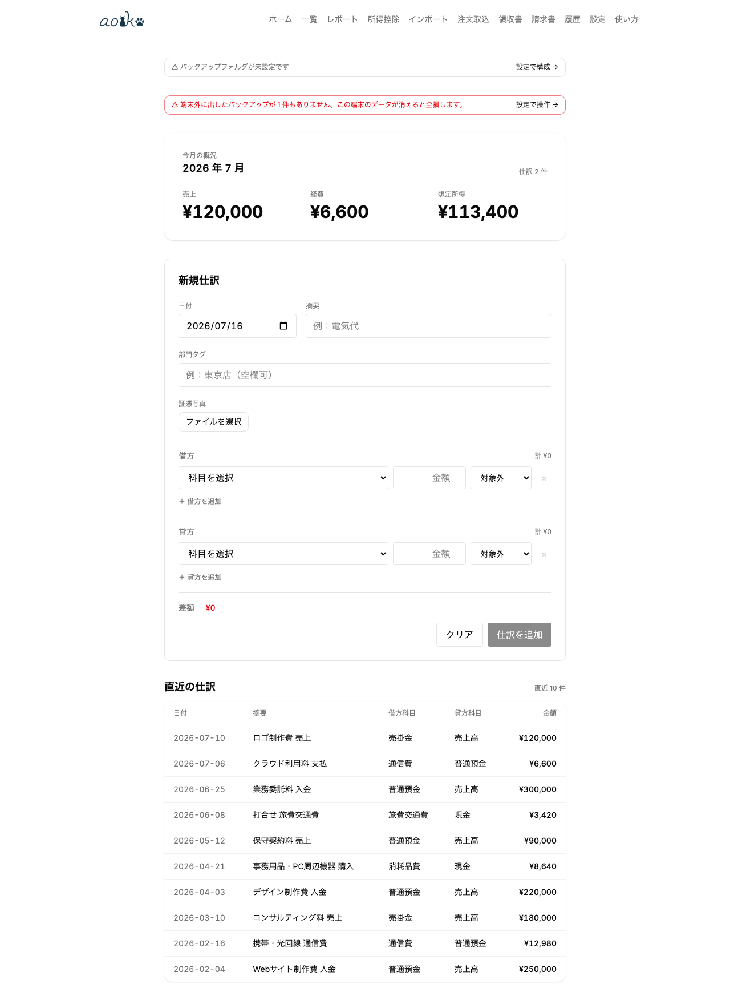
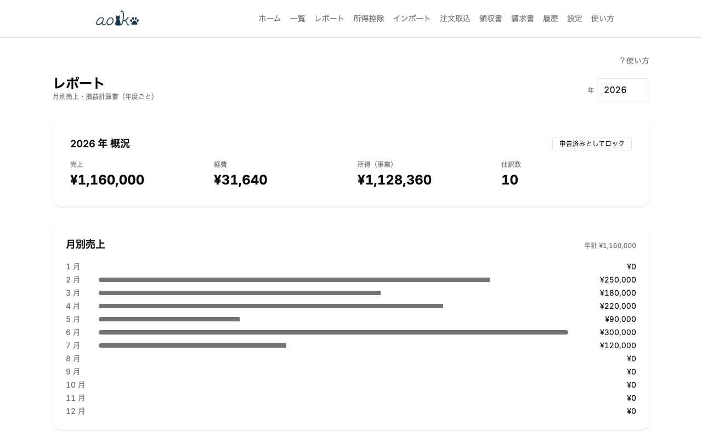

# aoiko（あおいこ）

  

**Language**: **日本語** | [English](README_en.md) | [繁體中文](README_zh-TW.md)

🌐 **オンライン版**: <https://aoiko.pages.dev>

日本の個人事業主向け、フロントエンドのみの帳簿ツール。青色申告特別控除は令和 9 年分以降 75 万円／65 万円／10 万円の三段階に対応（要件はマニュアル「01. 初回設定」「14. 所得控除・税額控除」参照）。CSV/OCR/EC 注文ページからの取り込み、複式簿記、減価償却、貸借対照表、`.xtx` 出力を Web App 単体で提供する。白色申告（収支内訳書）にも対応。バックエンド無し、BYOK（API キーは利用者が持参）。

  
  

## 主な機能

- **複式簿記**：仕訳・訂正仕訳（修正仕訳）・元の仕訳を保持する監査履歴
- **CSV 取り込み**：銀行＝三菱UFJ／三井住友／SBI新生／PayPay（クレジット決済運用、残高は未対応）、カード＝楽天／JCB（リクルートカード等含む）／セゾン／三井住友／三菱UFJ／au PAY／PayPay／ビュー（JRE CARD）／ライフ
- **取込履歴**：CSV インポートのバッチ単位履歴、ファイルハッシュによる重複検知、バッチごとの一括 reverse 対応
- **OCR**：領収書 → 仕訳候補。エンジンは Gemini Vision（既定）／OpenAI 互換 / Ollama 等のローカル vision AI／ブラウザ内蔵の AI／**Tesseract（完全ローカル WASM OCR・店名/品目は抽出せず欄は空のまま・人手確認前提）** から選択
- **注文取込（貼り付け → AI 抽出）**：Amazon・楽天 等の注文ページ全文を貼り付け、AI で品目内訳を抽出 → 確認 → 仕訳化。DOM のスクレイピングに依存せずサイト改修に強い
- **AI 分類**：CSV 行 → 勘定科目（ルール優先・AI フォールバック）。エンジンは Gemini／OpenAI 互換・Ollama 等のローカル AI／ブラウザ内蔵の AI から選択可
- **OCR/AI のプライバシー**：外部送信前に確認ダイアログ（設定でスキップ可）。Ollama 等を localhost 指定または Tesseract 選択時は画像が端末外に出ない（localhost を使う場合は Ollama 側の `OLLAMA_ORIGINS` で aoiko の公開 URL を許可しておく必要がある。Tesseract は言語データも同梱のため外部通信が一切発生しない）
- **家事按分**：自宅兼事務所の経費を事業使用分・事業主貸へ自動分割
- **減価償却**：定額法・200% 定率法（耐用年数 2〜20 年）、月按分・1 円残し
- **少額減価償却資産特例**：措法 28 の 2（30→40 万、2026-04-01〜）、年合計 300 万円上限管理
- **前期繰越**：前年末残高 → 期首振替仕訳の自動生成（純利益・事業主貸借を元入金へ吸収）
- **開業設定**：開業費・転用資産（非業務用→業務用転用の未償却残高を国税庁方式で自動計算）・自由項目をまとめて仕訳・固定資産登録
- **消費税概算**：本則課税・簡易課税（第 1〜6 種、常に表示）と、その年分に適用のある特例（2 割特例は 2026 年分まで、3 割特例は 2027・2028 年分）で比較、経過措置 80/70/50/30% 自動適用
- **e-Tax `.xtx` 出力**：確定申告書（KOA020）+ 決算書（青色申告決算書 KOA210 または収支内訳書 KOA110、確定申告方式で切替）を 1 ファイルに併載
- **レポート**：月別売上・損益計算書・貸借対照表・月別 PL（科目 × 月）・取引先別 / 補助科目別集計・消費税の方式比較
- **複合検索**：仕訳一覧で 年/月/摘要/金額範囲/取引先 の 2 項目以上の組み合わせ検索
- **請求書・見積書**：明細行・税率別内訳（インボイス制度の登録番号・税率別消費税額を記載）付きの作成・印刷、発行時の売掛金仕訳自動生成、打消し仕訳による訂正、見積書 → 請求書変換
- **修正申告ガイド**：申告済スナップショットと現在値の差分表示 + 提出手順
- **バックアップ**：File System Access API（Chromium）→ OPFS（Firefox / Safari 26 以降）の自動フォールバック（いずれも非対応なら手動ダウンロードのみ）
- **PWA**：記帳・レポート・減価償却・消費税計算・`.xtx`・請求書・見積書・バックアップ復元はオフラインで動作。Tesseract は初回認識時のみ同一オリジンから約 3MB の言語データを取得、クラウドエンジン利用時と第三者ライセンス一覧の表示には通信が必要

## 使い方

操作手順は [docs/manual/](docs/manual/README.md) を参照。初回設定・仕訳作成・CSV 取込・レポートを章ごとに説明（英語・繁体中国語版もあり）。

## ライセンス

[GNU Affero General Public License v3.0](LICENSE)（AGPL-3.0）

## 法務・安全に関する文書

- [DISCLAIMER.md](DISCLAIMER.md) — 免責事項（実申告・税法準拠・AI 利用リスク）
- [SECURITY.md](SECURITY.md) — セキュリティポリシー、脆弱性報告手順
- [PRIVACY.md](PRIVACY.md) — プライバシーポリシー、収集・送信データの内訳