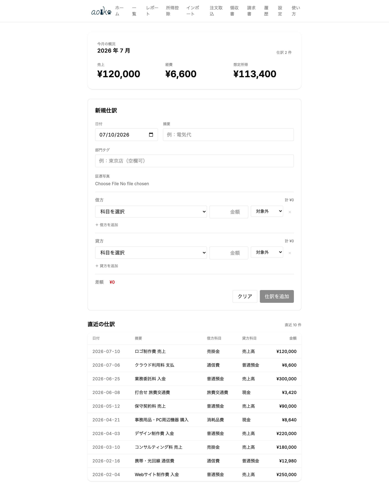
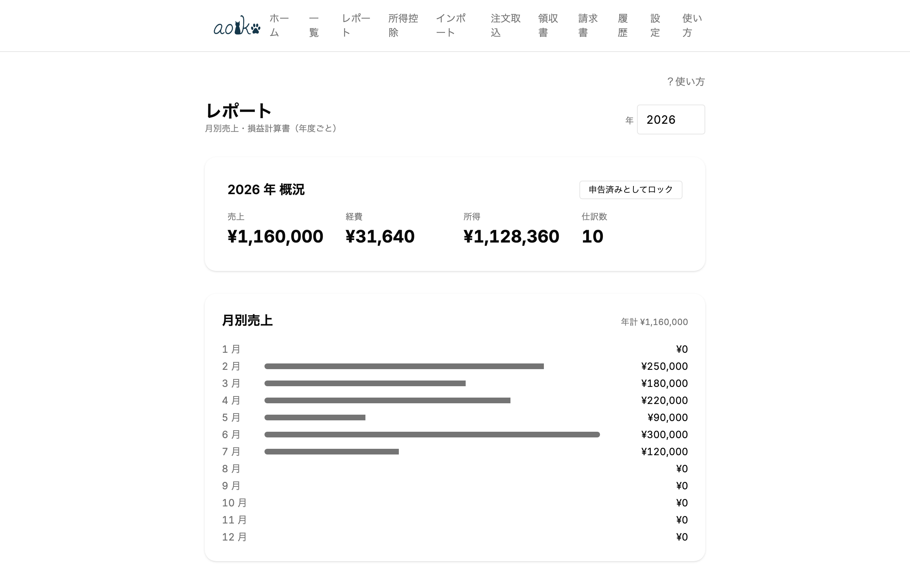

# aoiko（あおいこ）

<p align="center">
  
</p>

**Language**: [日本語](README.md) | **English** | [繁體中文](README_zh-TW.md)

[](https://github.com/Lonshaus/aoiko/actions/workflows/ci.yml) [](LICENSE)

🌐 **Try it online**: <https://aoiko.pages.dev> (trial only — see [Running locally](#running-locally) for caveats)

A pure-frontend bookkeeping tool for Japanese sole proprietors. Targets the **¥750,000 Blue Return (青色申告) deduction** for Reiwa 9 (2027) and later filings (requires on-time e-Tax submission + qualified electronic ledger storage; the older ¥650,000 deduction is still supported). Covers CSV/OCR/EC order page import, double-entry bookkeeping, depreciation, balance sheet, and `.xtx` (e-Tax format) export — all in a single web app. White Return (income/expense breakdown statement) is also supported. No backend, BYOK (you bring your own API key).

<p align="center">
  
  
</p>


## Features

- **Double-entry bookkeeping**: journal entries, correcting entries (修正仕訳), audit history in line with the Electronic Books Storage Act
- **CSV import**: banks = 三菱UFJ / 三井住友 / SBI新生 / PayPay (credit-card route only; balance not supported); cards = 楽天 / JCB (incl. Recruit Card) / セゾン / 三井住友 / 三菱UFJ / au PAY / PayPay / ビュー (JRE CARD) / ライフ. All validated against real CSVs.
- **Import history**: per-batch records, file-hash duplicate detection, batch-level reverse
- **OCR**: receipt → journal candidate. Engine selectable: Gemini Vision (default) / OpenAI-compatible / Ollama and other local vision LLMs / **Tesseract (purely-local WASM OCR — limited accuracy, manual verification required)**
- **Order import (paste → LLM extract)**: paste a full Amazon / 楽天 order page; an LLM extracts the line items → review → save. Resilient to UI changes since no DOM scraping.
- **LLM classification**: CSV line → account code (rule-first, LLM fallback). Engine selectable: Gemini or local AI.
- **OCR/LLM privacy**: pre-send confirmation dialog before external transmission. With Ollama on localhost or with Tesseract selected, images never leave your device (Ollama requires local distribution + `OLLAMA_ORIGINS`; Tesseract only downloads traineddata once from CDN, self-hostable for fully offline use).
- **Home office allocation**: auto-split mixed business / personal expenses into business portion and owner's draws
- **Depreciation**: straight-line and 200% declining-balance (useful lives 2–20 years), monthly proration, ¥1 residual
- **Small-asset depreciation special rule**: Sochiho Article 28-2 (¥300k → ¥400k threshold from 2026-04-01), with ¥3M annual cap tracking
- **Prior-period carryover**: auto-generate opening journal entries from prior year-end balances (net profit and owner's draws/contributions are absorbed into owner's capital)
- **Business opening setup (Opening Wizard)**: pre-opening expenses, converted assets (auto-computes the opening book value for personal-to-business conversions per NTA rules), and custom items — generates the journal entries and fixed-asset registrations in one go
- **Consumption tax estimation**: 4-method comparison (general / simplified / 2% special / 3% special), with the 80/70/50/30% transitional input-tax credit automatically applied
- **e-Tax `.xtx` export**: bundles the tax return (KOA020) with the matching financial statement (blue-return statements KOA210, or the income/expense breakdown statement KOA110 — switchable via filing type) into one file per the NTA's official XSD, verified against a real e-Tax software import
- **Reports**: monthly sales, P/L, balance sheet, monthly P/L (account × month), vendor / sub-account breakdowns, consumption-tax 4-way comparison
- **Composite search (qualified electronic ledger compliance)**: in the journal list, combine year / month / description / amount range / vendor (satisfies the Electronic Books Storage Act's "two or more arbitrary combination" requirement)
- **Amended filing guide**: diff between filed snapshot and current values + submission steps
- **Backup**: File System Access API (Chromium) with OPFS (Safari/Firefox) automatic fallback
- **PWA**: offline operation

## Tech stack

| Layer | Tech |
|-------|------|
| UI | Svelte 5 (runes) + Tailwind + bits-ui + shadcn-svelte |
| Build | Vite + vite-plugin-pwa |
| Storage | IndexedDB (Dexie) + File System Access API / OPFS |
| Money | Decimal.js (14+2 zero-padded sortable index) |
| OCR / LLM | Selectable: Google Gemini API (BYOK) / OpenAI-compatible / Ollama and other local vision LLMs / Tesseract (purely-local WASM OCR) |
| Test | Vitest + fake-indexeddb |
| Lang | TypeScript strict + `noUncheckedIndexedAccess` + `exactOptionalPropertyTypes` |

> SvelteKit is not used (pure SPA, custom history router).

## Directory layout

```
src/
├── domain/                    # Domain logic (framework-agnostic, Vitest-tested)
│   ├── journal.ts             # Journal entry creation / confirmation
│   ├── reverse.ts             # Correcting entries
│   ├── reports.ts             # P/L / BS / monthly / vendor breakdowns
│   ├── depreciation.ts        # Straight-line / declining-balance depreciation
│   ├── carryover.ts           # Prior-period carryover (opening journal)
│   ├── business-opening.ts    # Opening Wizard (converted-asset book value calc, opening entries)
│   ├── home-office.ts         # Home office allocation
│   ├── consumption-tax.ts     # Consumption tax 4 methods + transitional rule
│   ├── snapshots.ts           # Year-end lock (filed)
│   ├── amended.ts             # Amended filing guide
│   ├── llm-classify.ts        # LLM-based CSV line classification
│   ├── ocr.ts                 # Receipt OCR (vision LLM path)
│   ├── receipt-text-extract.ts # Raw OCR text → structured (Tesseract deterministic path)
│   ├── order-extract.ts       # Order page paste text → structured (LLM extract)
│   ├── rules.ts               # Rule engine
│   ├── send-confirm.ts        # External send confirmation logic
│   ├── import.ts              # CSV import orchestration
│   ├── import-batch.ts        # CSV import history / batch-level reverse
│   └── restore.ts             # Backup restore
├── parsers/                   # Bank / card CSV parsers (plugin-style)
├── routes/                    # Svelte routes (Home / JournalList / JournalEntryForm /
│                              #   Import / OrderImport / ImportHistory / Receipt /
│                              #   Reports / Settings)
├── components/                # Shared Svelte components (send-confirm dialog etc.)
├── stores/                    # Global state (class + singleton)
├── lib/                       # Shared helpers
│   ├── decimal.ts             # Decimal.js wrapper + sortable index conversion
│   ├── csv.ts                 # Standard CSV parser (BOM strip, quoted fields)
│   ├── llm-adapter.ts         # Vision LLM adapter factory (Gemini / OpenAI-compatible)
│   ├── receipt-extractor.ts   # OCR engine abstraction (vision LLM / Tesseract)
│   ├── order-extractor.ts     # Order import abstraction (wraps LLM adapter)
│   ├── ocr/tesseract-engine.ts # Tesseract WASM wrapper (dynamic import)
│   ├── settings.ts            # Settings KV store
│   ├── id.ts                  # ID generator
│   └── utils.ts               # shadcn-svelte utilities
├── db/                        # Dexie schema
├── backup/                    # Backup adapter (FSA / OPFS)
└── tax-schema/                # Year-versioned tax schemas
    └── 2026/                  # Account table + .xtx output (official XSD compliant; verified on real e-Tax software)
```

## Running locally

An online version is available at <https://aoiko.pages.dev>. However, it is **for trial only**, with the following caveats:

- It auto-deploys on every push to master, so **the version can change without notice** (you don't control update timing).
- For real bookkeeping/filing, **self-host locally where you can pin a version** (steps below).
- Data is stored only in your browser (IndexedDB) and never sent to a server. Use at your own risk.

To run it yourself, follow the steps below. Data lives in your browser's IndexedDB and never leaves your device (see [PRIVACY.md](PRIVACY.md)).

### Prerequisites

- [Node.js 22 LTS](https://nodejs.org/) or later
- npm (bundled with Node.js)
- Git (to clone the repo; ZIP download also OK)
- A modern browser (Chrome / Edge / Safari / Firefox)

### Startup

```bash
git clone https://github.com/Lonshaus/aoiko.git
cd aoiko
npm install
npm run build
npm run preview
```

Open <http://localhost:31527> in your browser. On first launch, accept the disclaimer, then enter your business name and fiscal year in Settings. To use OCR/LLM, pick an engine in Settings (Gemini API key / Ollama or other OpenAI-compatible endpoint / Tesseract [OCR-only, limited accuracy]).

### Install as a PWA (recommended)

Click the "Install" button in the address bar of Chrome / Edge — aoiko launches like a desktop app and works offline. Safari users: "Share" → "Add to Home Screen".

### Where data is stored

- Journals, fixed assets, vendors, settings → IndexedDB in the browser (on-device, no server transmission)
- "Settings" → "Backup" lets you pick a local folder for automatic JSON backups (File System Access API; OPFS fallback for unsupported browsers)

If you clear browser data, IndexedDB is wiped. Regularly export manually (in Settings) or configure a backup folder.

### Updating

```bash
git pull
npm install
npm run build
npm run preview
```

Open <http://localhost:31527> in your browser. If you've installed it as a PWA, a "new version" prompt appears on launch.

## Usage

See [docs/manual/](docs/manual/README_en.md) for step-by-step operating instructions. Covers initial setup, journal entries, CSV import, and reports in dedicated chapters (Japanese and Traditional Chinese versions also available).

## Development

```bash
npm install
npm run dev        # Dev server (http://localhost:10708)
npm run test       # Vitest
npm run check      # svelte-check type checking
npm run build      # Production build
npm run preview    # Preview the build (http://localhost:31527)
npm run verify     # check + test + build
```

Node 22 LTS (CI also runs 22; locally Node 24 also works since `engines: >=22`) / npm (bundled with Node.js).

## License

[GNU Affero General Public License v3.0](LICENSE) (AGPL-3.0)

## Legal & safety documents

- [DISCLAIMER_en.md](DISCLAIMER_en.md) — Disclaimer (actual filing / tax-law compliance / LLM usage risks)
- [SECURITY_en.md](SECURITY_en.md) — Security policy, vulnerability reporting
- [PRIVACY_en.md](PRIVACY_en.md) — Privacy policy, data collection / transmission breakdown