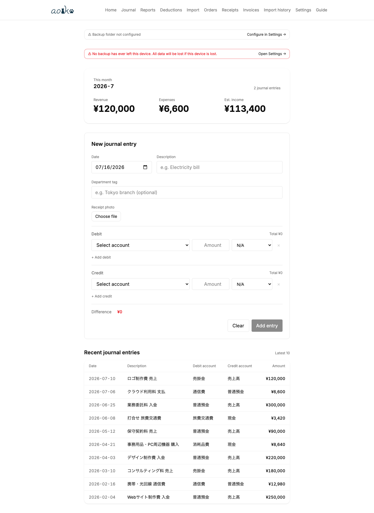
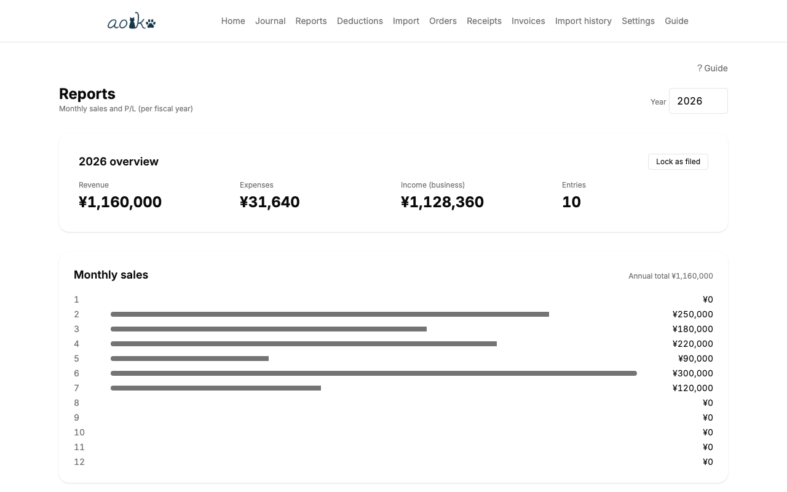

# aoiko（あおいこ）

  

**Language**: [日本語](README.md) | **English** | [繁體中文](README_zh-TW.md)

🌐 **Online**: <https://aoiko.pages.dev>

A pure-frontend bookkeeping tool for Japanese sole proprietors. Supports the three-tier Blue Return (青色申告) deduction from Reiwa 9 (2027) — ¥750,000 / ¥650,000 / ¥100,000 (see the manual's "01. Initial setup" and "14. Income & tax deductions" chapters for the requirements). Provides CSV/OCR/EC order page import, double-entry bookkeeping, depreciation, balance sheet, and `.xtx` (e-Tax format) export in a single web app. White Return (income/expense breakdown statement) is also supported. No backend, BYOK (you bring your own API key).

  
  

## Features

- **Double-entry bookkeeping**: journal entries, correcting entries (修正仕訳), audit history that preserves the original entry
- **CSV import**: banks = 三菱UFJ / 三井住友 / SBI新生 / PayPay (credit-card route only; balance not supported); cards = 楽天 / JCB (incl. Recruit Card) / セゾン / 三井住友 / 三菱UFJ / au PAY / PayPay / ビュー (JRE CARD) / ライフ
- **Import history**: per-batch records, file-hash duplicate detection, batch-level reverse
- **OCR**: receipt → journal candidate. Engine selectable: Gemini Vision (default) / OpenAI-compatible / Ollama and other local vision AIs / your browser's built-in AI / **Tesseract (purely-local WASM OCR — does not extract vendor or items, manual verification required)**
- **Order import (paste → AI extract)**: paste a full Amazon / 楽天 order page; an AI extracts the line items → review → save. Resilient to UI changes since no DOM scraping.
- **AI classification**: CSV line → account code (rule-first, AI fallback). Engine selectable: Gemini / OpenAI-compatible / Ollama and other local AIs / your browser's built-in AI.
- **OCR/AI privacy**: pre-send confirmation dialog before external transmission (skippable via a setting). With Ollama on localhost or with Tesseract selected, images never leave your device (to use localhost, allow aoiko's public URL in Ollama's `OLLAMA_ORIGINS` setting; Tesseract bundles its language data too, so it makes no external request at all).
- **Home office allocation**: auto-split mixed business / personal expenses into business portion and owner's draws
- **Depreciation**: straight-line and 200% declining-balance (useful lives 2–20 years), monthly proration, ¥1 residual
- **Small-asset depreciation special rule**: Sochiho Article 28-2 (¥300k → ¥400k threshold from 2026-04-01), with ¥3M annual cap tracking
- **Prior-period carryover**: auto-generate opening journal entries from prior year-end balances (net profit and owner's draws/contributions are absorbed into owner's capital)
- **Business opening setup (Opening Wizard)**: pre-opening expenses, converted assets (auto-computes the opening book value for personal-to-business conversions per NTA rules), and custom items — generates the journal entries and fixed-asset registrations in one go
- **Consumption tax estimation**: compares general and simplified taxation (categories 1–6, always shown) plus the special provision that applies to that year (the 20% special provision through 2026, the 30% special provision for 2027–2028), with the 80/70/50/30% transitional input-tax credit automatically applied
- **e-Tax `.xtx` export**: bundles the tax return (KOA020) with the matching financial statement (blue-return statements KOA210, or the income/expense breakdown statement KOA110 — switchable via filing type) into one file
- **Reports**: monthly sales, P/L, balance sheet, monthly P/L (account × month), vendor / sub-account breakdowns, consumption-tax method comparison
- **Composite search**: in the journal list, combine two or more of year / month / description / amount range / vendor
- **Invoices & quotations**: create and print documents with line items and per-rate tax breakdowns (includes the invoice-system registration number and per-rate consumption tax amounts), auto-generates the accounts-receivable journal entry on issue, corrections via reversing entries, quotation-to-invoice conversion
- **Amended filing guide**: diff between filed snapshot and current values + submission steps
- **Backup**: File System Access API (Chromium) with OPFS (Firefox / Safari 26 and later) automatic fallback (manual download only when neither is available)
- **PWA**: bookkeeping, reports, depreciation, consumption-tax calculation, `.xtx`, invoices/quotations, and backup restore all work offline. Tesseract fetches about 3MB of language data from the same origin on its first recognition; cloud engines and viewing the third-party license list require a connection

## Usage

See [docs/manual/](docs/manual/README_en.md) for step-by-step operating instructions. Covers initial setup, journal entries, CSV import, and reports in dedicated chapters (Japanese and Traditional Chinese versions also available).

## License

[GNU Affero General Public License v3.0](LICENSE) (AGPL-3.0)

## Legal & safety documents

- [DISCLAIMER_en.md](DISCLAIMER_en.md) — Disclaimer (actual filing / tax-law compliance / AI usage risks)
- [SECURITY_en.md](SECURITY_en.md) — Security policy, vulnerability reporting
- [PRIVACY_en.md](PRIVACY_en.md) — Privacy policy, data collection / transmission breakdown