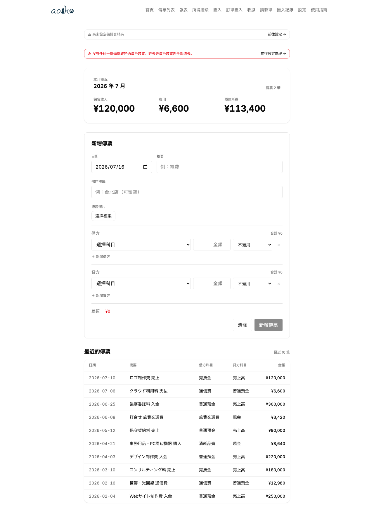
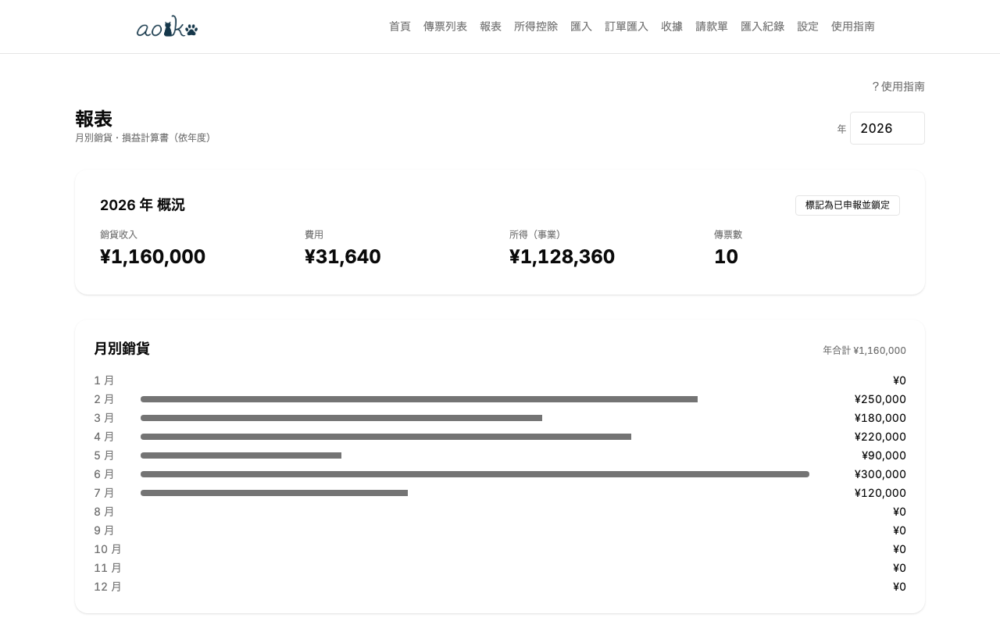

# aoiko（あおいこ）

  

**Language**: [日本語](README.md) | [English](README_en.md) | **繁體中文**

🌐 **線上版**: <https://aoiko.pages.dev>

給日本個人事業主用的純前端記帳工具。支援青色申告特別控除，自令和 9 年分起分為 75 萬／65 萬／10 萬圓三段（要件見手冊「01. 初次設定」「14. 所得控除・稅額扣抵」）；以單一 Web App 提供 CSV／OCR／EC 訂單頁匯入、複式簿記、折舊、資產負債表、`.xtx`（e-Tax 申報檔）輸出。也支援白色申告（収支内訳書）。無後端、BYOK（API 金鑰使用者自備）。

  
  

## 主要功能

- **複式簿記**：傳票、沖銷傳票、保留原始傳票的稽核紀錄
- **CSV 匯入**：銀行＝三菱 UFJ／三井住友／SBI 新生；支付 App＝PayPay（僅支援信用卡支付，不支援餘額）；卡片＝楽天／JCB（含 Recruit Card 等）／セゾン／三井住友／三菱 UFJ／au PAY／PayPay／ビュー（JRE CARD）／ライフ
- **匯入紀錄**：CSV 匯入的批次紀錄、檔案 hash 重複偵測、可整批沖銷
- **OCR**：收據 → 傳票候選。引擎可選：Gemini 影像辨識（預設）／OpenAI 相容・Ollama 等本機影像辨識 AI／瀏覽器內建的 AI／**Tesseract（純本機 WASM OCR、不抽取店名・品項（欄位維持空白）、必須人工確認）**
- **訂單匯入（貼上 → AI 抽取）**：把 Amazon・楽天等的訂單頁全文貼進來，由 AI 抽取品項明細 → 確認 → 轉成傳票。不依賴 DOM 解析，所以網站改版也不受影響
- **AI 分類**：CSV 列 → 會計科目（規則優先，沒有符合的規則時自動改用 AI）。引擎可選 Gemini／OpenAI 相容・Ollama 等本機 AI／瀏覽器內建的 AI
- **OCR/AI 隱私**：對外送出前會跳確認對話框（可在設定跳過）。把 Ollama 等指向 localhost、或選 Tesseract 時，影像不會離開本機（使用 localhost 時需在 Ollama 端的 `OLLAMA_ORIGINS` 允許 aoiko 的公開網址；Tesseract 的語言資料也由 aoiko 自己提供，完全不會有對外連線）
- **家事分攤**：把住家兼辦公室的經費自動拆成事業用部分與事業主貸
- **折舊**：定額法、200% 定率法（耐用年數 2〜20 年）、舊定額法、舊定率法、租賃期間定額法、一括償却資産（3 年均等攤銷）、月分攤、保留 1 圓殘值
- **少額減価償却資産特例**：措法 28 之 2（30→40 萬圓、2026-04-01 起），年合計 300 萬圓上限管理
- **上期結轉**：去年年末餘額 → 期初結轉傳票自動產生（淨利、事業主貸借吸收至元入金）
- **開業設定**：開業費、轉用資產（私用轉事業用的未折舊餘額依國稅廳的方式自動計算）、自由項目，一次產生傳票與固定資產登錄
- **消費稅概算**：本則課稅、簡易課稅（第 1〜6 種，一律顯示）與該年分適用的特例（2 割特例到 2026 年分為止，3 割特例限 2027、2028 年分）比較，80/70/50/30% 經過措置自動套用
- **e-Tax `.xtx` 輸出**：確定申告書（KOA020）+ 決算書（青色申告決算書 KOA210 或収支内訳書 KOA110，依確定申告方式切換）併載於同一檔。有不動產所得時也會併載不動產所得用的決算書（KOA220 或 KOA130）。消費稅申告書（本則課稅・簡易課稅・2 割特例）另以單獨檔案輸出
- **報表**：月別銷貨、損益計算書、資產負債表、月別損益（科目 × 月）、依交易對象／輔助科目彙總、消費稅計算方式比較
- **複合搜尋**：傳票列表可以組合兩項以上的年/月/摘要/金額範圍/交易對象來搜尋（只有從請款單建立的傳票才帶有交易對象）
- **請款單・報價單**：含明細列與依稅率分組的明細（記載適格請求書制度的登錄號碼、各稅率消費稅額）的製作與列印、發行時自動產生売掛金傳票、以沖銷傳票訂正、報價單 → 請款單轉換
- **修正申告指南**：已申報快照與目前值的差異顯示＋提交流程
- **備份**：File System Access API（Chromium）不支援時自動改用 OPFS（Firefox / Safari 26 以後），兩者都不支援時只剩手動匯出
- **PWA**：記帳・報表・折舊・消費稅計算・`.xtx`・請款單・報價單・備份還原都可離線運作。Tesseract 只在首次辨識時從同源取得語言資料，使用雲端引擎與查看第三方授權清單則需要連線

## 使用方式

操作步驟請見 [docs/manual/](docs/manual/README_zh-TW.md)。分章節說明初次設定・建立傳票・CSV 匯入・報表（日文・英文版也有）。

## 授權

[GNU Affero General Public License v3.0](LICENSE)（AGPL-3.0）

## 法務・安全相關文件

- [DISCLAIMER_zh-TW.md](DISCLAIMER_zh-TW.md) — 免責事項（實際申報、稅法遵循、AI 使用風險）
- [SECURITY_zh-TW.md](SECURITY_zh-TW.md) — 安全政策、漏洞回報流程
- [PRIVACY_zh-TW.md](PRIVACY_zh-TW.md) — 隱私政策、資料收集／送出明細